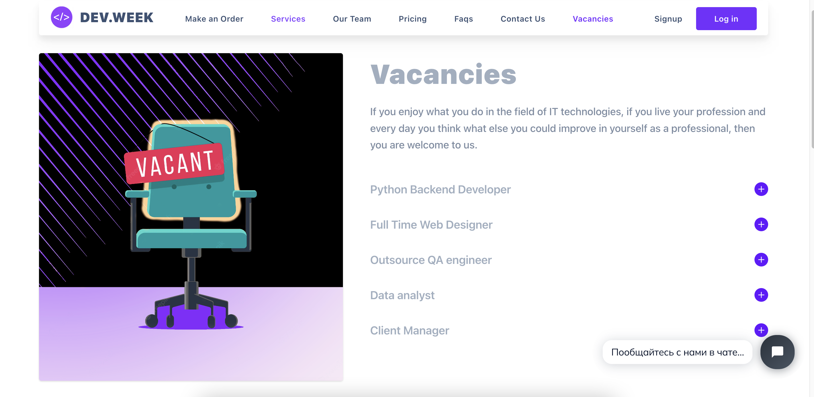

<div align="center" style="margin-top: 40px;">

  

  <h1>CRM FOR IT COMPANY</h1>
  
  <p>
     A centralized multifunctional platform for selling it services and organizing relationships with customers throughout the entire period of interaction with them.
  </p>

  <p>
    Recently, in many markets there have been problems associated with a shortage of demand. 
    It has become even more difficult to remain competitive, working according to the old schemes. 
    A CRM system can give a new impetus to almost any business, increase labor efficiency and increase profits. 
    My software solves several problems at once, its implementation contributes to automation, 
    fast processing of information and optimization of business processes related to clients.
  </p>

<!-- Badges -->
<p>
  <a href="https://github.com/Louis3797/awesome-readme-template/graphs/contributors">
    
  </a> 
  <a href="">
    
  </a>
  <a href="https://github.com/Louis3797/awesome-readme-template/network/members">
    
  </a>
  <a href="https://github.com/Louis3797/awesome-readme-template/stargazers">
    
  </a>
  <a href="https://github.com/Louis3797/awesome-readme-template/issues/">
    
  </a>
  <a href="https://github.com/Louis3797/awesome-readme-template/blob/master/LICENSE">
    
  </a>
</p>

<h4>
    <a href="https://github.com/Louis3797/awesome-readme-template/">
    View Customer Demo
    </a>
  <span> · </span>
    <a href="https://github.com/Louis3797/awesome-readme-template">
    View Employee Demo
    </a>
  <span> · </span>
    <a href="https://github.com/Louis3797/awesome-readme-template/issues/">API Docs</a>
  <span> · </span>
    <a href="https://github.com/Louis3797/awesome-readme-template/issues/">Request Feature</a>
  </h4>
</div>

<br />

<!-- Table of Contents -->
# :notebook_with_decorative_cover: Table of Contents

- [:notebook_with_decorative_cover: Table of Contents](#notebook_with_decorative_cover-table-of-contents)
  - [:star2: About the Project](#star2-about-the-project)
    - [:camera: Screenshots](#camera-screenshots)
    - [:space_invader: Tech Stack](#space_invader-tech-stack)
    - [:dart: Features](#dart-features)
    - [:art: Static User List](#art-color-reference) 
    - [:key: Environment Variables](#key-environment-variables) 
  - [:toolbox: Getting Started](#toolbox-getting-started)
    - [:gear: Installation](#gear-installation)
    - [:running: Run Locally](#running-run-locally) 
    - [:triangular_flag_on_post: Deployment](#triangular_flag_on_post-deployment)
  - [:compass: Roadmap](#compass-roadmap)
  - [:grey_question: FAQ](#grey_question-faq)
  - [:warning: License](#warning-license)
  - [:handshake: Contact](#handshake-contact)
  - [:gem: Acknowledgements](#gem-acknowledgements)

  
<!-- About the Project -->
## :star2: About the Project


<!-- Screenshots -->
### :camera: Screenshots

<div style="display: flex; justify-content: center; flex-wrap: wrap; padding: 10px;">
  
  
  
  
  
  
</div>

<!-- TechStack -->
### :space_invader: Tech Stack

<div style="display: flex; justify-content: center; padding: 30px; flex-wrap: wrap">
  <div align="center" style="padding: 0 3px"> 
    
  </div>
  <div align="center" style="padding: 0 3px"> 
    
  </div>
</div>

<details>
  <summary>Customer Client</summary>
  <ul>
    <li><a href="https://reactjs.org/">React</a></li>
    <li><a href="https://www.typescriptlang.org/">Typescript</a></li>
    <li><a href="https://redux.js.org/">Redux</a></li>
    <li><a href="https://tailwindcss.com/">TailwindCSS</a></li>
    <li><a href="https://www.tidio.com/">Tidio Chat</a></li>
    <li><a href="https://www.npmjs.com/package/axios/">Axios</a></li>

  </ul>
</details>

<details> 
  <summary>Employee Client</summary>
  <ul>
    <li><a href="https://reactjs.org/">React</a></li>
    <li><a href="https://www.typescriptlang.org/">Typescript</a></li>
    <li><a href="https://redux.js.org/">Redux</a></li>
    <li><a href="https://mui.com/material-ui/">Material UI</a></li>
    <li><a href="https://echarts.apache.org/en/index.html">Echarts</a></li>
    <li>
      <a href="https://js.devexpress.com/Documentation/ApiReference/UI_Components/dxFileManager/">
        DevExtream File Manager
      </a>
    </li>
    <li><a href="https://www.material-react-table.com/">material-react-table</a></li>
    <li><a href="https://quilljs.com/">Quill</a></li>
    <li><a href="https://www.npmjs.com/package/react-toastify/">Toastify</a></li>
    <li><a href="https://www.npmjs.com/package/react-trello/">React Trello</a></li>
    <li><a href="http://matx-react.ui-lib.com//">Layout Template</a></li>

  </ul>
</details>

<details>
  <summary>Server</summary>
  <ul>
    <li><a href="https://www.typescriptlang.org/">PHP 8</a></li>
    <li><a href="https://expressjs.com/">Laravel 9</a></li> 
    <li><a href="https://go.dev/">JWT Auth (php-open-source-saver/jwt-auth)</a></li>
  </ul>
</details>

<details>
<summary>Database</summary>
  <ul>
    <li><a href="https://www.mysql.com/">MySQL</a></li>
    <li><a href="https://www.postgresql.org/">utf8_general_ci</a></li>
  </ul>
</details>

<details>
<summary>DevOps</summary>
  <ul>
    <li><a href="https://www.docker.com/">Docker</a></li>
  </ul>
</details>

<!-- Features -->
### :dart: Features

## Basic Features

### 1.1 Main
  - Storage of customer data
  - Storage of employee data (mail, full name, position, level, number of connected projects
  - Tracking interactions and activity.
  - Measuring performance and productivity
 
### 1.2 Communication channels
- Chat for guest clients
- Chat for authorized customers
- Chat for employees
- News section (for employee)
    
### 1.3 Statistic 
- Sales funnel,
- Dynamics of new users, orders for the last months
- Map of the largest projects,
- The ratio of successful orders
- The Most popular types of projects
- The most popular reasons for canceling an order

### 1.4 Features for developers
- Project page as a quick way to inform the developer about the project
- List of Connected Projects 
- File Manager for every project 
- Personalized Kanban board for task scheduling
- Action History
- List of Participants

### 1.5 Recruiting
- Opportunity to apply for a job (for the position required by the company with the attachment of a resume)
- Job creation (by employee)
- Application history storage
- Changing the status of a job application (with a response to the mail)

## Special Features and Benefits

1. Two types of fully functional tables (sorting, filtering, pagination)
2. Account settings section for an employee
3. Order status tracking for a customer
4. The interface provides comfortable navigation from anywhere
5. The project was developed using modern technologies and is easily scalable
6. Saving multiple bank cards
7. List of transactions for a specific order and payment history in general
8. Internal notification system


<!-- Color Reference -->
### :art: Static User List

For all users password by default is <strong>password</strong> 

| Role      | Email               | Password |
|-----------|---------------------|----------|
| Admin     | admin@gmail.com     | password |
| Manager   | manager@gmail.com   | password |
| Developer | developer@gmail.com | password |
| Customer  | customer@gmail.com  | password |


<!-- Env Variables -->
### :key: Environment Variables

To run this project, you will need to add the following environment variables to your .env file

#### General: 

`API_KEY`

`JWT_SECRET`

`JWT_ALGO=HS256`

`FILESYSTEM_DISK=public`

#### Mail: 

`MAIL_MAILER=smtp`

`MAIL_HOST=smtp.mailtrap.io`

`MAIL_PORT=2525`

`MAIL_USERNAME=30feef52e2d893`

`MAIL_PASSWORD=693744b59f1f44`

`MAIL_ENCRYPTION=tls`

<!-- Getting Started -->
## 	:toolbox: Getting Started

<em>This project uses NPM as package manager</em>

<!-- Installation Client -->
### :gear: Installation Main Dependency 

Install Node.js

- https://nodejs.org/en/ 

Install PHP 8.0

- https://www.php.net/downloads.php

Install Composer
```bash
  php -r "copy('https://getcomposer.org/installer', 'composer-setup.php');"
  php -r "if (hash_file('sha384', 'composer-setup.php') === '55ce33d7678c5a611085589f1f3ddf8b3c52d662cd01d4ba75c0ee0459970c2200a51f492d557530c71c15d8dba01eae') { echo 'Installer verified'; } else { echo 'Installer corrupt'; unlink('composer-setup.php'); } echo PHP_EOL;"
  php composer-setup.php
  php -r "unlink('composer-setup.php');"
```   


<!-- Run Locally -->
### :running: Run Locally

Clone the project

```bash
  git clone https://github.com/EvgeniyRyabchuk/IT_Company_CRM
```

### 1. Set up Customer Client 

Go to the customer client directory

```bash
  cd ./customer_client
```

Install dependencies

```bash
  npm install
```

Start the Customer Client

```bash
  npm run start
```

### 2. Set up Employee Client

Go to the customer client directory

```bash
  cd ./it_company_crm_client
```

Install dependencies

```bash
  composer install 
```

Start the Customer Client

```bash
  npm run start
```

### 3. Set up Server 

Go to the api directory

```bash
  cd ./itCompanyCrmApi
```

Install dependencies

```bash
  composer install --ignore-platform-req=php
```

Generate the project key

```bash
 php artisan key:generate 
```

Database migrate and seed 

```bash
  php artisan migrate:refresh --seed
```

Start server

```bash
  php artisan serve
```

<!-- Deployment -->
### :triangular_flag_on_post: Deployment

To deploy both of React Client, run
```bash
  npm run build 
```

<!-- Roadmap -->
## :compass: Roadmap

* [x] Invoice
* [ ] Client History


<!-- FAQ -->
## :grey_question: FAQ

- Question 1
  + Answer 1
  
- Question 2
  + Answer 2


<!-- License -->
## :warning: License

Distributed under the no License. See LICENSE.txt for more information.

<!-- Contact -->
## :handshake: Contact

GitHub Profile - [EvgeniyRyabchuk](https://github.com/EvgeniyRyabchuk) - evgen.ryabchuk@gmail.com

Project Link: [https://github.com/EvgeniyRyabchuk/IT_Company_CRM](https://github.com/EvgeniyRyabchuk/IT_Company_CRM)

<!-- Acknowledgments -->
## :gem: Acknowledgements

Use this section to mention useful resources and libraries that you have used in your projects.

 - [Shields.io](https://shields.io/)
 - [Awesome README](https://github.com/matiassingers/awesome-readme)
 - [Emoji Cheat Sheet](https://github.com/ikatyang/emoji-cheat-sheet/blob/master/README.md#travel--places)
 - [Readme Template](https://github.com/othneildrew/Best-README-Template)
